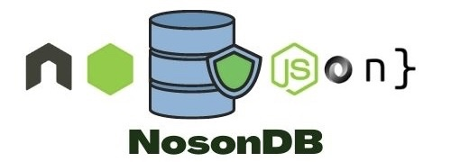

    <a href="https://twitter.com/tush_tr604" target="blank"></a> 

# nosondb



A json based database you can use in your nodejs projects just by installing the package.

nosondb enables you to use a json file as a database for your project.

# How to use it?

### Installing the package

```sh
npm i @tush-tr/nosondb
```

### Require the package in your JS file

```js
const nosondb = require("@tush-tr/nosondb")
```

### Create a new instance from the required package

```js
const nosondb = require("@tush-tr/nosondb")
const nodb = new nosondb("db.json") // specify your json file name you want to use as database
```

# Functionalities

### <li>Creating a record

```js
await nodb.create(data)
```

### <li>Updating a record

```js
await nodb.update(id,data)
```


### <li>Deleting a record

```js
await nodb.delete(id)
```

### <li>Finding all records

```js
const allData = await nodb.getAll();
```

### <li>Finding one specific record by Id

```js
const specificData = await nodb.getOne(id)
```

### <li>Finding one specific record by filters

```js
const filteredData = await nodb.getOneBy(data)
```


# Examples


### <li>Create a record

```js
const createRecord = async ()=>{
    await nodb.create({name: "Product1",price: 12})
}
```

A new object will be created inside your json file with a id field also.

### <li>Update a record

```js
const updateRecord = async ()=>{
   await nodb.update("800dc06c",{name: "Keyboard"})
}
```

first argument of update function will take your id name.

### <li>Delete a record

```js
const deleteRecord = async ()=>{
    await nodb.delete("800dc06c")
}
```

delete function also requires id name.

### <li>Find all records

```js
const findRecords = async ()=>{
    const allData = await nodb.getAll();
    console.log(allData)
}
```

### <li>Find one specific record by Id

```js
const findRecord = async ()=>{
    const specificData = await nodb.getOne("800dc06c")
    console.log(specificData)
}
```

### <li>Find one specific record by filters

```js
const createRecord = async ()=>{
    const filteredData = await nodb.getOneBy({name: 'Product1'})
    console.log(filterdData)
}
```
    
### <li> Find some records by filters
    
```js
const fetchRecords = async ()=>{
    const filteredData = await nodb.getAllBy({name: 'Product1'})
    console.log(filterdData)
}    
```

# Contributing 🍻

I welcome pull requests, bug fixes and issue reports. Before proposing a change, please discuss your change by raising an issue.

# Maintainer 😎

[Tushar Rajpoot](https://twitter.com/tush_tr604)


## License

[MIT license](LICENSE) © Tushar Rajpoot
